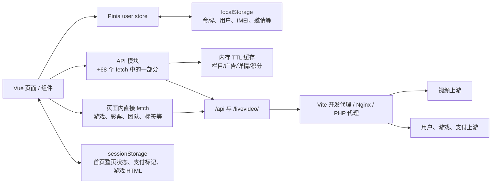
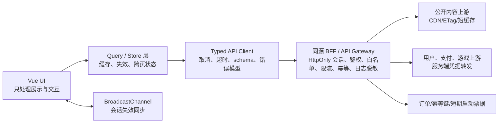

# 影视网站优化审查报告

> 审查日期：2026-07-13  
> 范围：当前工作区的 Vue 3/Vite 前端、API 适配层、`nginx-config.conf`、`public/proxy.php` 与测试配置。  
> 方法：静态代码审查、类型检查、单元测试启动检查、ESLint 检查、产物与资源体积盘点。未对两套上游服务发起探测，也未验证 Nginx/PHP 配置是否已实际部署；涉及它们的结论应在部署环境中复核。

## 结论摘要

项目已经具备一些正确的优化方向：路由组件按需加载、顶部 loading 计数、用户积分请求去重、栏目/广告/详情的短 TTL 缓存，以及视频详情请求序号防止旧响应覆盖新页面。这些改动能改善普通浏览体验。

但目前的主要问题不在“再加一个缓存”，而在安全边界、状态权威性和接口层收敛：

1. **游戏启动链路会把上游返回的原始 HTML 写入同源 iframe。** 一旦上游响应、代理或链路被篡改，该 HTML 可在本站源下执行脚本，读取浏览器中的令牌和用户资料。这是最高优先级问题。
2. **令牌同时存于 `localStorage`、出现在 URL 查询参数、浏览器控制台和代理日志中。** 结合上述 XSS 风险，令牌泄露的概率和影响都很高；支付、提现、游戏等高价值接口均受影响。
3. **数据流分散。** 68 个 `fetch` 分布在 API 模块和多个大页面中，缺少统一超时、取消、重试、错误归一化、响应校验及脱敏日志；同一领域在多个页面各自实现。
4. **存储与缓存有正确的去重，但没有容量、版本、集中失效和跨标签页策略。** 尤其是首页状态被重复序列化，详情缓存 Map 无上限，刷新积分又会意外延长本地令牌过期时间。
5. **质量门禁不可用。** 类型检查通过，但单元测试无法加载配置；ESLint 报 156 个错误；端到端用例仍是脚手架断言，且端口配置与 Vite 配置不一致。

建议先完成 P0 安全止血，再用一个轻量 BFF（Backend for Frontend）和统一 API Client 收敛数据流，最后逐步拆分巨型页面与补齐测试。不要在 P0 完成前扩大缓存和支付/游戏功能。

可直接交给实现模型的文件级改造步骤、接口约束、验证命令和提示词见 [DeepSeek 改造执行指南](./DEEPSEEK改造执行指南.md)。

## 现状数据流

当前的关键缺口是：浏览器直接拥有并转发上游凭据，且代理只是透传层。客户端状态、请求构建、业务适配和错误处理混杂在页面中，因而很难在一个位置统一实施安全、缓存和可观测性策略。

## 审查基线与可复现结果

| 项目 | 结果 | 说明 |
| --- | --- | --- |
| `npm run type-check` | 通过 | `vue-tsc --build` 未报告类型构建错误。 |
| `npm run test:unit -- --run` | 失败 | Vitest 加载 `vitest.config.ts` 时，`unplugin-vue-components` 报 `paths[0]` 为 `undefined`，测试尚未运行。 |
| `./node_modules/.bin/eslint . --no-fix` | 失败，156 errors | 主要为 `any`、未使用导入/变量、测试无断言和三斜线引用。现有 `npm run lint` 带 `--fix`，不适合作为只读 CI 检查。 |
| 测试覆盖 | 仅 2 个测试文件 | `HelloWorld.spec.ts` 是脚手架测试且无断言；`e2e/vue.spec.ts` 断言模板文本 `You did it!`。 |
| 请求与日志 | 68 个 `fetch`、558 个 `console.*` | 表明网络逻辑和原始响应日志高度分散。 |
| 可维护性 | 8 个页面超过 1,000 行 | 最大为 `RechargeView.vue` 2,761 行、`GameView.vue` 2,475 行。 |
| 静态资源 | `src/assets/img` 约 6.6 MB；当前 `dist` 约 12.1 MB | 当前 `dist/` 还含约 5.4 MB 的 `归档.zip`；应避免将其随部署目录保留。 |

`vite.config.ts` 将开发服务器配置为 3001 端口，而 `playwright.config.ts` 期望 5173（CI 为 4173）；即使修复单元测试配置，端到端执行也需要先统一这项配置。

## 发现与优先级

### P0：立即处理

| 编号 | 问题与证据 | 风险 | 建议验收标准 |
| --- | --- | --- | --- |
| SEC-01 | 游戏入口把 `result.data.html` 写入 `sessionStorage`，随后 `GamePlayView` 使用 `document.write(normalizedHtml)` 注入 `about:blank` iframe。见 `src/views/GameSecondaryView.vue:752-760`、`src/views/GamePlayView.vue:56-79`。iframe 没有 `sandbox`，而 `about:blank` 继承本站源。 | 上游或传输链路中任一环节返回恶意 HTML，即可同源执行并读取 `localStorage` 令牌、调用站内接口或篡改支付页面。 | 暂停 HTML 启动模式；只允许经服务端校验的 HTTPS URL，并使用 `sandbox` iframe（默认不加 `allow-same-origin`）及域名白名单。若业务必须消费 HTML，放到独立无凭据域名渲染，采用一次性短期启动 ID，绝不 `document.write` 上游原文。 |
| SEC-02 | 令牌写入 `user_info` 和独立 `user_token`，见 `src/api/core/auth-session.ts:88-90`；许多用户接口再把令牌加入 `URLSearchParams`，例如 `src/api/modules/user-points.ts:36-45`、`src/api/modules/withdraw.ts`、`src/views/GameSecondaryView.vue`。`useVideoCharge.ts:22-29` 甚至同时放入请求头和 URL。 | URL 会进入访问日志、代理日志、浏览器历史、监控及可能的 Referer；`localStorage` 可被任何同源 XSS 读取。已与 SEC-01 形成可直接接管会话的组合风险。 | 立刻轮换现有令牌，删除生产日志中的历史令牌；令牌只由服务端保管，浏览器改用 `HttpOnly; Secure; SameSite` 会话 Cookie。过渡期至少从 URL、控制台和错误字符串移除令牌，并只在请求头/POST body 中传递。 |
| SEC-03 | 参考 Nginx 配置两处均为 `proxy_ssl_verify off`（`nginx-config.conf:56`、`:109`），PHP 代理也关闭 `CURLOPT_SSL_VERIFYPEER` 与 `CURLOPT_SSL_VERIFYHOST`；同时会记录目标 URL 和转发后的完整请求头，后者可能包含 token（`public/proxy.php`）。 | 对视频、用户、支付、提现请求失去 TLS 身份校验；中间人可篡改内容或窃取凭据。日志又会扩大泄露面。 | 生产环境必须开启证书与主机名校验，固定可信 CA；日志只记录 request ID、接口名、状态、耗时和脱敏错误码，禁止记录 query、Cookie、Authorization、token、密码、完整响应。 |
| SEC-04 | 代理暴露了广泛的上游路径/服务透传能力，CORS 使用 `Access-Control-Allow-Origin: *` 与 `Allow-Credentials: true`，还保留公开调试分支和 `public/test-config.html`。见 `nginx-config.conf:28-42`、`:81-95`、`public/proxy.php`。 | 即使浏览器对通配来源与凭据的组合会限制读取，该配置仍不清晰、不可审计；公开代理/调试面容易被滥用，并泄露内部接口形态。 | 移除生产调试页、`debug` 分支和 PHP 代理（二选一保留受控网关）；按路由白名单、方法、请求体大小、来源、速率限制配置 BFF/Nginx。CORS 只允许实际前端域名，不与通配来源混用凭据。 |

### P1：第一个迭代完成

| 编号 | 问题与证据 | 影响 | 建议 |
| --- | --- | --- | --- |
| DATA-01 | `setUserInfo` 每次执行都把本地过期时间重置为“当前时间 + 12 小时”；积分刷新成功后又调用它（`auth-session.ts:79-101`、`user-points.ts:145-154`）。 | 高频刷新余额会持续延长“12 小时”客户端会话，令牌生命周期不再是固定策略；资料更新和会话续期耦合，难以推理。 | 分为 `establishSession`、`updateProfile`、`clearSession`。只有登录/服务端 refresh token 成功能写入 expiry；资料、积分、头像更新不可改变会话过期时间。以服务端会话过期为唯一真相。 |
| DATA-02 | 充值、提现、游戏归集等写操作直接从浏览器调用上游，缺少服务端幂等键、订单状态机和统一的认证错误处理。页面仅以局部 `isLoading` 防重复。 | 双击、重放、弱网重试或多个标签页可产生重复操作，前端无法保证资金类操作的一致性。 | 将创建订单、提现、扣点、游戏资金归集迁移至 BFF；每个 mutation 使用 `Idempotency-Key` 和服务端去重表，返回稳定订单 ID。前端根据订单状态轮询/订阅，而不是猜测“支付已完成”。 |
| NET-01 | 网络逻辑分布在 API 模块和页面中，68 个 `fetch` 绝大多数没有 `AbortController`、客户端超时、请求标识、重试分级或统一业务码解析。详情页虽以请求序号避免旧响应覆盖，但并未取消旧网络请求。 | 切换分类/搜索/返回页面时会浪费并发连接，慢响应可能改写未保护的页面状态；故障处理和认证失效表现不一致。 | 建立一个唯一 `apiClient`：统一 base URL、认证、超时、取消、错误模型、响应 schema、脱敏日志、request ID。路由/筛选变化时取消旧 GET；只对可安全重试的 GET 使用指数退避，绝不自动重试支付/提现/扣费。 |
| DATA-03 | `videoDetailCaches`、`detailRecommendCaches` 和 `adsCache` 是无上限 Map；过期条目只在“再次访问同 key”时删除，`invalidateAllApiCaches` 仅在退出/令牌失效时执行。见 `src/api/core/cache.ts:37-110`。详情推荐 cache key 未包含用户身份。 | 长会话或高频浏览可持续占用内存；若推荐接口今后按用户个性化，可能发生跨账号读取过期推荐的逻辑问题。 | 采用可配置的 LRU（最大条目数/最大字节数/TTL），周期性 sweep；明确 `public` 与 `private(userId)` key 空间。由 mutation 精准失效相关 query，而不是仅在登出时全清。 |
| DATA-04 | 首页把完整 tab 状态同时写入 `homeViewState` 和 `tabStates`（`HomeView.vue:1205-1219`），每次切换/保存都会序列化视频数组；没有条目上限、版本号、schema 校验或统一配额策略。`clearAllCache` 未删除 `homeViewState`。 | 主线程同步序列化增加卡顿与存储配额风险；版本升级、损坏 JSON 和登出后的残留难以治理。 | 只保留一个版本化 key，如 `app:v2:home-cache`；最多缓存最近 3 个分类、每类最多 N 页/条、只存必要字段；设置 `expiresAt`，在登录身份变化、登出和 schema 不匹配时删除。较大离线数据使用 IndexedDB，不使用 `sessionStorage`。 |
| SEC-05 | 支付/游戏/广告 URL 来自路由或上游数据并被 `iframe`/`window.open` 使用；多个 `window.open(..., '_blank')` 未加 `noopener,noreferrer`，`PaymentView` 直接解码 query 中的 URL 到 iframe。`RechargeView` 用 `v-html` 将渠道名称中的 `$` 替换为 ` `，未先转义原始文本。 | 恶意广告、渠道名或手工构造路由可造成钓鱼、tabnabbing 或 DOM XSS。 | 在 BFF 下发前校验 URL，前端再次仅允许 `https:` 和业务白名单；统一 `openExternal` 强制 `noopener,noreferrer`。将 `v-html` 改为分行文本节点/数组渲染。支付页使用后端保存的短期 order ID，不能从 query 接受任意 URL。 |
| DATA-05 | API 返回大量 `any` 和多套手写适配，且只检查 `response.ok` 后直接 `json()`；ESLint 已报出许多 `no-explicit-any`。 | 上游字段变化会在页面深处才报错，难以定位，且缓存可能保存畸形数据。 | 为每个上游响应建立 Zod/Valibot schema 和 DTO；在 API Client 边界做 parse、字段默认化与业务码归一化，页面只接收稳定的领域模型。 |
| OBS-01 | 代码中有 558 个 `console.*`，多处打印 `formData`、query、用户信息、完整结果；例如登录、退出、创建充值订单、游戏搜索。 | 生产控制台可能泄露密码、令牌、订单、个人资料；海量日志也掩盖真正故障。 | 生产移除调试日志；替换为结构化遥测，字段白名单和强制脱敏。错误上报使用 trace ID，并采集接口名、状态、耗时、网络类型，不上传秘密或完整响应。 |

### P2：第二个迭代处理

| 编号 | 问题 | 建议 |
| --- | --- | --- |
| STORE-01 | Pinia 初始化时从 `localStorage` 读取资料，并通过单个回调同步；没有 `storage` 事件或 `BroadcastChannel`。多标签登录、登出、资料变更不会可靠一致。 | 将会话变更通过 `BroadcastChannel('app-session')` 广播；收到登出/令牌刷新立即失效内存 query。资料以服务端/BFF 为准。 |
| STORE-02 | `pending_payment_order` 仅保存时间戳，读取时没有 TTL、订单 ID 或服务端状态验证；游戏 HTML 使用随机 session key，刷新或异常退出后没有统一清理策略。 | session 中只保存短期 opaque ID 与 `expiresAt`；服务端校验订单/启动状态。增加启动时清理过期前缀 key 的函数。 |
| PERF-01 | Nginx 对所有代理请求关闭 buffering，未区分视频流与 JSON；公开接口没有 CDN/反向代理缓存、ETag 或 stale-while-revalidate 策略。 | 仅对真实流媒体关闭 buffering；栏目、广告、标签、公开视频列表在 BFF/CDN 层配置短缓存与 `ETag`。私有接口禁缓存或使用私有、用户隔离的缓存键。 |
| PERF-02 | 已使用图片懒加载和路由分包，但当前图片目录约 6.6 MB；最大 HLS 包约 512 KB，当前部署目录还保留历史 zip。静态缓存规则只有一个月且不覆盖所有 Vite hash 资源。 | 为封面/活动图使用 CDN 转码、WebP/AVIF、`srcset` 和尺寸裁剪；HLS 仅在播放器需要时动态加载。对带 hash 的 `assets/*` 使用一年 `immutable` 缓存、Brotli；部署前清理 `dist`，禁止 zip/日志/调试文件进入发布包。 |
| MAINT-01 | `RechargeView`、`GameView`、`ProfileView`、`HomeView` 等巨型 SFC 同时承担请求、DTO 转换、状态机、路由、渲染和样式；游戏/彩票/团队页面还有页面内 fetch。 | 按领域拆为 `features/{payments,games,profile,home}`：`api`、`schemas`、`queries`、`stores`、`components`、`views`。View 只编排 UI；直接 fetch 全部迁入领域 API。 |
| UX-01 | 许多滚动、定时器和异步任务依赖局部 flag；部分页面有事件/定时器但缺少与请求取消对应的清理。 | 统一使用 composable 管理 listener、timer、request scope；用 `onScopeDispose` 自动回收。为加载、空、错、重试建立统一状态组件与错误文案。 |

## 推荐的目标架构

### 认证与资料

- 浏览器不再保存或拼接上游 token；BFF 通过 `HttpOnly; Secure; SameSite=Lax/Strict` Cookie 维护本站会话。
- BFF 在服务端保存/刷新上游 token，或将其映射为短生命周期会话；所有 URL、Referer、错误和日志中不得出现 token、密码、身份证/银行卡等敏感字段。
- Pinia 只保存非敏感、可重新拉取的 profile 快照。`profile` 更新不得改变 session expiry。
- 每个标签页收到 `session:logout`、`session:changed` 广播后立即清理 store 和私有缓存。

### 存储与缓存策略

| 数据 | 真相来源 | 前端保存方式 | 建议有效期/上限 | 失效条件 |
| --- | --- | --- | --- | --- |
| 登录会话 | BFF | HttpOnly Cookie，不可被 JS 读取 | 服务端控制 | 登出、服务端拒绝、续期失败 |
| 用户资料、余额、VIP | BFF | Pinia 内存；可选无敏感快照 | 余额 10–30 秒；资料按页面重验 | 充值、提现、扣点、资料修改、跨标签广播 |
| 栏目、标签、广告 | BFF/CDN | Query 内存 LRU | 5–10 分钟，按体积/条目限制 | 后台发布 webhook / TTL |
| 视频详情/推荐 | BFF | Query 内存 LRU | 2 分钟、最多 50 条；若个性化必须含 userId | 购买、点赞/收藏、登录身份变化 |
| 首页列表和滚动位 | 页面内存 + 单一 session key | 只存必要字段 | 最近 3 个分类、每类最多 2 页、30 分钟 | schema 变更、过期、登出 |
| 支付、提现、游戏启动 | BFF 订单/短票据 | session 中只存 opaque ID | 5–15 分钟 | 订单完成/取消/过期 |

### API Client 的职责

统一客户端应提供如下不可绕过的能力：

- `GET` 默认 10–15 秒超时，可传入页面 `AbortSignal`；分类、搜索、路由变化时取消旧请求。
- 仅对 GET/幂等读取请求做有限指数退避；充值、提现、购买、资金归集只允许用户显式重试，并携带 BFF 生成的幂等键。
- 按 schema 解析 HTTP 状态、业务状态和响应体，输出统一 `ApiError`（网络、超时、未认证、限流、上游异常、数据不合法）。
- 只记录脱敏后的错误上下文和 trace ID；不得返回包含 token 的错误字符串。
- 基于资源而非页面调用：例如 `payments.createOrder`、`wallet.withdraw`、`games.launch`、`videos.list`；禁止 View 内直接 `fetch`。

## 分阶段落地计划

### 第 0 阶段：安全止血（1–3 天）

1. 下线 `document.write` 游戏 HTML 路径；停用 raw HTML/sessionStorage 启动方式。
2. 轮换已发令牌，删除生产/开发共享日志中敏感 query 和请求头；删除所有打印密码、token、订单、完整用户对象的日志。
3. 所有令牌从 URL 移除；支付、游戏、提现接口在服务端转发前不得接受 token query。
4. 若参考配置正在使用：开启 TLS 校验，收紧 CORS，移除 `proxy.php?debug=test` 和公开测试页，限制代理路由/方法/速率/请求体。
5. 为广告、支付、游戏、客服 URL 建立协议和域名 allowlist；所有新窗口统一 `noopener,noreferrer`。

**验收：** 安全扫描和人工检查中不存在 `document.write` 上游响应、token/password 进入 URL/console/log、关闭 TLS 校验或开放式生产调试入口；登录后 DevTools 的 Application Storage 中不存在可读 token。

### 第 1 阶段：收敛身份、交易和请求层（1–2 周）

1. 建立最小 BFF：先覆盖登录/登出/资料/积分/订单/提现/游戏启动，逐步代理公开视频接口。
2. 将会话改为 HttpOnly Cookie；拆分 `establishSession` 与 `updateProfile`，修复积分刷新重置过期时间的问题。
3. 引入 API Client、schema 与领域 API；迁移页面内直接 fetch。
4. 为支付、提现、购买、资金归集实现服务端订单状态机和幂等键。
5. 使用 `BroadcastChannel` 实现会话与私有缓存跨标签同步。

**验收：** 高价值 mutation 可安全重放而不产生重复结果；接口层有统一超时、取消、认证错误和脱敏日志；用户切换/登出不会复用上一用户私有缓存。

### 第 2 阶段：存储、缓存和性能（1–2 周）

1. 用 LRU Query Cache 取代无界 Map，明确 public/private key 和 mutation invalidation。
2. 合并首页 session 状态为一个版本化 key，增加容量、TTL、过期清理和 JSON schema 防护。
3. 在 BFF/CDN 为公开内容增加 ETag、短缓存和 stale-while-revalidate；私有数据严格隔离。
4. 清理部署包，删除历史 zip、日志和测试 HTML；配置静态资源 immutable 缓存、Brotli、图片 CDN 转码。
5. 为包体积建立预算，确保 HLS 只在播放器路由加载。

**验收：** 长时间浏览详情页内存稳定；首页 storage 不重复且有上限；冷启动请求数、LCP、错误率均可监控并有基线。

### 第 3 阶段：模块化与质量门禁（持续）

1. 先拆支付、游戏、首页三条高变更链路，迁移为 feature 目录和 composable/query 组合。
2. 修复 ESLint 的 156 个错误，拆分 `lint`（只读）与 `lint:fix`（显式修复）。
3. 修复 Vitest 配置加载；统一 Vite 与 Playwright 端口；删除脚手架测试。
4. 在 CI 强制执行：类型检查、只读 lint、单元/组件测试、契约测试、关键 E2E、生产构建、依赖与秘密扫描、包体积预算。

## 测试与观测性补齐清单

| 层级 | 应覆盖的场景 |
| --- | --- |
| 单元测试 | session 过期不被 profile 更新延长；缓存 LRU/TTL/失效；URL allowlist；金额校验；API error 分类；敏感字段脱敏。 |
| 契约测试 | 两套上游成功/失败/认证失效/字段缺失/非 JSON 响应均能被 schema 正确处理。 |
| BFF 集成测试 | Cookie 会话、CORS、限流、token 不出现在日志或 URL、订单幂等、游戏短票据过期。 |
| E2E | 游客登录→正式登录→登出；首页切换与返回；视频购买；充值回调与余额刷新；提现防重复；游戏安全启动；跨标签登出。 |
| 安全回归 | 不允许 `javascript:`/非白名单 URL；不允许 raw HTML 注入；iframe sandbox；CSP、HSTS、`frame-src`、`connect-src` 策略。 |
| 运行时指标 | API p50/p95、超时率、认证失败率、缓存命中率、订单重复拒绝数、前端异常率、LCP/INP/CLS、内存/存储配额错误。 |

## 现有优点及保留建议

- `fetchVideoDetail`、栏目列表和广告接口已经有 in-flight 去重；迁移到 Query 层时应保留这一语义。
- 视频详情和推荐通过请求序号避免过期响应覆盖 UI；下一步将序号升级为真正的请求取消。
- 路由组件使用动态 import，Vite 也已对 Vue、Vant、HLS、二维码库进行了分包；不要因为迁移 API 层破坏按路由加载。
- 用户积分的 30 秒缓存与刷新后更新 store 的意图正确；应保留“单请求、短缓存、mutation 后失效”，但把资料更新与会话续期解耦。

## 关键证据索引

- 会话保存、过期计时和清理：`src/api/core/auth-session.ts`。
- 内存 TTL 缓存与无界 Map：`src/api/core/cache.ts`；积分缓存：`src/api/core/points-cache.ts`、`src/api/modules/user-points.ts`。
- 视频请求去重与详情 cache key：`src/api/modules/video.ts`。
- 首页双写 session 状态：`src/views/HomeView.vue:1205-1279`。
- 游戏 HTML 写入与同源 iframe：`src/views/GameSecondaryView.vue:752-779`、`src/views/GamePlayView.vue:56-79`、`:286-304`。
- 支付 URL/iframe 与 `v-html`：`src/views/RechargeView.vue:430-433`、`:461-517`、`:1146`，`src/views/PaymentView.vue:116-145`。
- 上游代理安全配置：`nginx-config.conf`、`public/proxy.php`、`public/.htaccess`。
- 测试失效来源：`vitest.config.ts`、`e2e/vue.spec.ts`、`playwright.config.ts`、`vite.config.ts`。

## 不在本次审查内的事项

本报告未验证上游接口的真实鉴权、是否支持幂等键、支付回调签名、数据库事务、服务端日志留存、CDN 配置和实际生产 Nginx/PHP 生效状态。因此，BFF 方案中的上游适配、订单状态机和安全头策略需要结合现网部署、支付渠道协议和合规要求完成设计评审。
